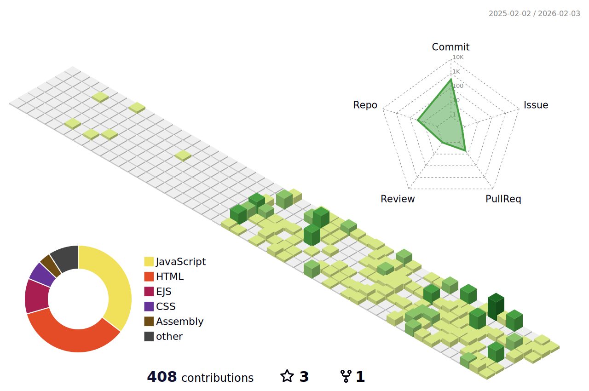

### 𝐏𝐑𝐀𝐘 - 𝐄𝐀𝐓 - 𝐂𝐎𝐃𝐄 🎯

#### :rocket: My Projects

* [Ali-s-Quran-Site](https://github.com/Ali1180-uni/Ali-s-Quran-Site) - Verse Finder Quran Site, A @sakoon._alquran Project ⭐
* [ChatBot-by-Ali](https://github.com/Ali1180-uni/ChatBot-by-Ali) - Chatbot Project Using Gemini SDK with React & Node.js
* [Mini-Chat-web-Application](https://github.com/Ali1180-uni/Mini-Chat-web-Application) - Real-time Chat App with React & Socket.io
* [Github-to-docx](https://github.com/Ali1180-uni/Github-to-docx) - GitHub crawler that generates Word document reports
* [SEF-PROJECT-BLOG-SITE](https://github.com/Ali1180-uni/SEF-PROJECT-BLOG-SITE) - Blog Site with CRUD Operations & Authentication
* [DSA-Practice-By-Ali](https://github.com/Ali1180-uni/DSA-Practice-By-Ali) - Data Structures & Algorithms Practice

#### :memo: About Me

- 🎓 Student at **NTU, Faisalabad**
- 🔭 Currently working on **React, Node.js, Docker**
- 🌱 Learning **Full Stack Development & DSA**
- 👯 Open to collaborate on interesting projects
- 💬 Ask me about **Web Development, Python, C++**

#### :link: Connect with Me

